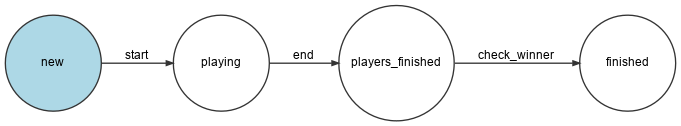
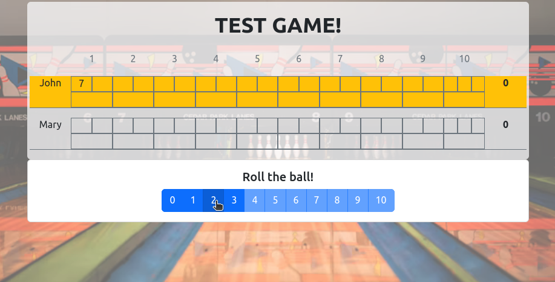

# MY SOLUTION

## Framework

The application is running on a symfony 6.2 webapp, started using symfony-cli in development mode.  
The database is persisted using a postgresql, started using docker containers.  

If your equipment has **symfony-cli** and **docker-compose** installed, you can start the application by running the **make start_dev** recipe.    

You can also bring it down by running **make stop_dev**.  

## Solving the problem

In order to simulate the bowling game, there are three state machine workflows.  
Each one of those state machines are controlled by its MessageHandler, that propagates messages between them, in order to orchestrate the game.

### Workflows 

The first of them is the one that controls the **Game** entity.  
  

The next one is the **Player** state machine.  
  

And the last one is the **Frame** state machine.  
  

### How it works

A Game entity starts in **NEW** state and, after it is setup by adding players to it, it transitions to **PLAYING** state.  

While in this state, the players plays the game in turns.  
The Game selects which Player has to play, transitions it from **WAITING** to **PLAYING** and allows it to follow the Frame's workflow, which will be explained below.  
When its turns finishes, he returns it to **WAITING** state and another Player is selected.  
This situation is repeated over and over until all players have finished all the Game's frames.  
After that, they are transitioned to **FINISHED** state instead of **WAITING** and then the Game transitions to **PLAYERS_FINISHED** state, where it will check the winner player and finally transition to **FINISHED** state.  

The Frame's workflow is a bit more complicated, the transitions depends on the rules defined in the bowling game.  

It starts in the **NEW** state. The player rolls the ball, the pins scored are recorded and, depending on the pins thrown, it transitions to different states:
- If the player has thrown all the available pins, he scored an **strike**, 
  - In that case, if the frame is the last one in the game, it is transitioned to the **THIRD_ROLL** state.
  - If not, that frame will receive a bonus for the following two rolls and it transitions to the **WAIT_SCORE** state with a wait value of **2**. It will also propagate the end of player's turn.  
- In any other case, it transitions to **SECOND_ROLL** state.  

When in **SECOND_ROLL** state, the player throws the ball again, the pins scored are recorded and ...
- If the player has thrown all the available pins, he scored an **spare**, 
  - In that case, if the frame is the last one in the game, it transitions to the **THIRD_ROLL** state.
  - If not, that frame will receive a bonus for the following roll, so the frame transitions to the **WAIT_SCORE** state with a wait value of **1**. It will also propagate the end of player's turn.  
- In any other case, it transitions to **DONE** state and propagates the end of player's turn.

When in **THIRD_ROLL** state, the player throws the ball, the pins scored are recorded twice in the current frame (once for the roll and once for the propagation) and the frame transitions to **DONE** state, finishing the player's turn.

Every time a ball has been thrown, the pins scored are also propagated to all the player's frames in **WAIT_SCORE** state, decrementing it's wait value. If this value arrives to zero it will also transition that frame to **DONE** state.

### Technology

All this procedure has been done using Symfony's built-in Workflows (in this case State Machines), Messages and MessageHandlers.  
All game's logic is directly controlled by the entities related to the game.

The only messages that came from outside the Game is when the GameController tells the Game that it has to start and when a ball is rolled.

## Playing the Game

By default, the game is accessible through http://localhost:8000, where a new game can be created.  

Here you can name the game as you want and click on **Create** button.  

After that, you are redirected to the Setup procedure, where the players will be added to it.  

You can add as many players as you want (#TODO: will have to limit that in future versions).  
I've added **John** and **Mary**. After that you can proceed to **Start Game**. 

At this moment, the court is ready and player can roll the ball in turns. The player rolling the ball is the one with an orange background below its name.   

The ball can be rolled by clicking the buttons below (from 0 to 10), that represents the number of pins thrown in each roll.

The players play their frames by turns until the last frame is played.  

## Tests

Unit Tests are implemented for all the procedures.  
They can be run executing **make tests** recipe.  

There are 22 tests with 145 assertions, covering more than 90% of app code.  
